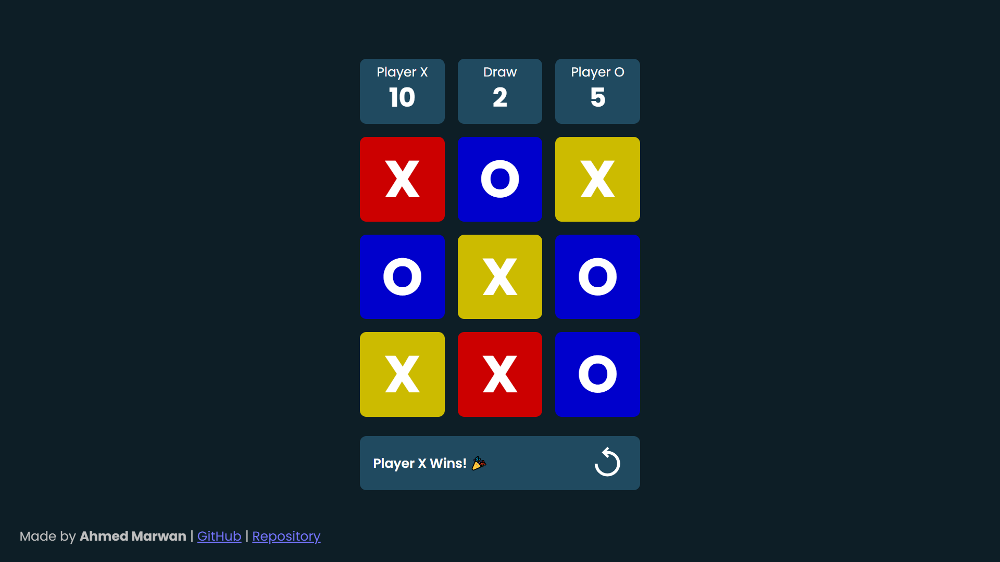

# Tic Tac Toe

A clean and interactive Tic-Tac-Toe game built with **HTML, CSS, and Vanilla Javascript**.  
Designed with clear game logic, smooth UI feedback, and a simple scoreboard for multiple rounds.

## Features
- Classic 3×3 Tic-Tac-Toe gameplay
- Turn-based play for Player X and Player O
- Automatic win and draw detection
- Winning cells highlighted visually
- Score tracking for X, O, and draws
- Restart button to play new rounds without resetting scores
- Responsive layout suitable for desktop and mobile

## How It Works
- Click an empty cell to place your symbol (X or O).
- The game automatically checks for a win or a draw after each move.
- When a round ends, the result is displayed and the three cells that made the winning line are highlighted.
- Use the Restart button to start a new round without resetting scores.

## Tech Stack
- HTML
- CSS
- Vanilla Javascript

## Live Demo
👉 **Live Version:** [https://AhmedMarwanDev.github.io/tic-tac-toe-js](https://AhmedMarwanDev.github.io/tic-tac-toe-js)

## Screenshot

---

Made by **Ahmed Marwan**